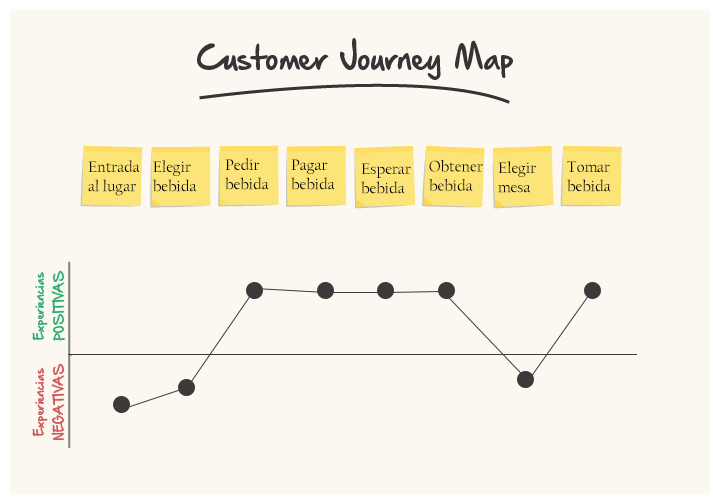

# CUSTOMER JOURNEY
## Starbucks

Se divide en dos aspectos Experiencia Positiva y Experiencia Negativa.

Experiencia Positiva: El momento de pedir la bebida fue muy fácil ya que el mismo cajero te va preguntando punto por punto respecto lo que estas pidiendo evitando confusiones, al finalizar tu pedido se paga de manera inmediata, el producto en sí fue bueno, ya que cumplió con lo esperado.

Experiencia Negativa: El lugar es muy pequeño, lo hace complicado el ingreso ya que había muchas personas al momento que yo llegue al lugar, la fila para ser atendido me resulto un poco larga, al momento de ver el menú fue un poco complicado ya que la tipografía no me ayudo a tener una fácil lectura, al finalizar al haber tantas personas no había un lugar libre para sentarme y disfrutar de mi bebida, por lo cual decidí por salir del lugar e ir tomando mi bebida en el camino.

